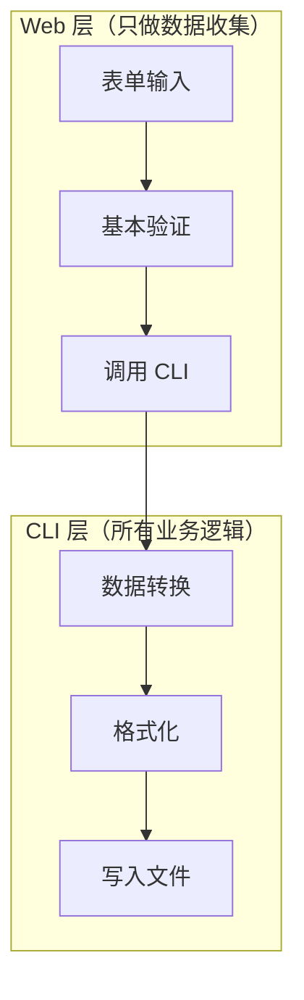

# AGENTS.md - Life Index 项目开发指南

> 本文档为 Life Index 项目开发、为 AI 编码代理提供项目上下文。  
> **最后更新**: 2026-03-29 | **版本**: v1.2 | **状态**: 活跃维护

## 项目概述

**Life Index** 是一个 Agent-first、local-first 的个人人生日志与检索系统。当前项目同时包含：

- **Layer A / Core**：CLI 原子工具（write / search / edit / abstract / weather / index / backup）
- **Layer C / Optional Shell**：可选本地 Web GUI（dashboard / search / write / journal / edit / settings）

用户既可以通过自然语言 + Agent 调用 Python 原子工具，也可以通过浏览器访问同一份本地数据。

**核心理念**:
- **Agent-first**：发挥 Agent 自然语言理解和生成能力，仅在需要原子性/准确性时开发专用工具
- **本地优先**：所有数据存储在 `~/Documents/Life-Index/`
- **纯文本格式**：Markdown + YAML Frontmatter，永不过时

**关键架构决策**:
- **双管道并行检索架构** 关键词管道 ∥ 语义管道并行执行 + RRF 融合
- **数据物理隔离**：用户数据在 `~/Documents/Life-Index/`，项目代码在仓库目录
- **CLI 为 SSOT**：Web GUI 必须调用 CLI 工具，不得绕过（详见 [`docs/ARCHITECTURE.md`](docs/ARCHITECTURE.md) §1.5 交互范式）
- **人-Agent-CLI 三层信息流**：CLI 是 Agent 的母语，GUI 是人的母语（详见 [`docs/ARCHITECTURE.md`](docs/ARCHITECTURE.md) §1.5）

---

## Web GUI 开发约束（强制）

### 核心原则

**CLI 是最高 SSOT，Web GUI 只是 CLI 的薄封装。**

> 交互范式详见 [`docs/ARCHITECTURE.md`](docs/ARCHITECTURE.md) §1.5 人-Agent-CLI 三层信息流。



### Web 层允许的操作

| 操作 | 允许 | 示例 |
|------|------|------|
| 收集表单数据 | ✅ | `tags: str = Form("")` |
| 基本验证 | ✅ | 检查必填字段、CSRF |
| 调用 CLI 工具 | ✅ | `write_journal(data)` |
| 文件上传暂存 | ✅ | `tempfile.NamedTemporaryFile` |
| HTML 渲染 | ✅ | Jinja2 模板 |

### Web 层禁止的操作

| 操作 | 禁止 | 原因 |
|------|------|------|
| 数据格式转换 | ❌ | CLI 负责统一格式 |
| 自己生成 frontmatter | ❌ | 使用 `format_frontmatter()` |
| 自己解析/写入日志文件 | ❌ | 调用 `write_journal`/`edit_journal` |
| 绕过 CLI 直接操作数据 | ❌ | 破坏 SSOT 原则 |

### 数据流规范

```python
# ✅ 正确：Web 层只收集，CLI 层处理
form_data = {"tags": "tag1, tag2, tag3"}  # 原始输入
result = write_journal(form_data)  # CLI 负责分割

# ❌ 错误：Web 层自己处理格式
form_data = {"tags": ["tag1", "tag2", "tag3"]}  # Web 层分割了
```

### 测试要求

**每个 Web 路由必须有端到端格式测试：**

```python
# tests/contract/test_web_cli_alignment.py
def test_edit_tags_format_matches_cli():
    """编辑后的 tags 格式必须与 CLI 写入的格式一致"""
    # 通过 Web 编辑
    web_result = edit_via_web(tags="tag1, tag2")
    # 通过 CLI 写入
    cli_result = write_via_cli(tags=["tag1", "tag2"])
    
    # 格式必须一致
    assert web_result["frontmatter"]["tags"] == cli_result["frontmatter"]["tags"]
```

### 检查清单

**开发 Web 功能时必须确认：**

- [ ] 是否调用了 CLI 工具？
- [ ] 是否在 Web 层做了数据转换？（如果是，移到 CLI）
- [ ] 是否有端到端格式测试？
- [ ] 修改后是否运行了 `tests/contract/` 测试？

---

## 构建与运行命令

### 依赖安装

```bash
# Python 3.11+ (核心运行环境)
# pip install -e . 已包含语义搜索依赖（fastembed）
```

### 核心工具命令

```bash
# 推荐（pip install 后）
life-index write --data '{"title":"...","content":"...","date":"2026-03-07","topic":"work"}'
life-index search --query "关键词" --level 3
life-index edit --journal "Journals/2026/03/life-index_2026-03-07_001.md" --set-weather "晴天"
life-index abstract --month 2026-03
life-index weather --location "Lagos,Nigeria"
life-index backup --dest "D:/Backups/Life-Index"
life-index index           # 增量更新
life-index serve           # 启动本地 Web GUI

# 开发者模式（无需安装）
python -m tools.write_journal --data '{...}'
python -m tools.search_journals --query "关键词"
```

---

## 模块结构

> **详细模块说明**: 参见 [`tools/lib/AGENTS.md`](tools/lib/AGENTS.md)

```
tools/                         # Core CLI/tool layer
├── write_journal/
├── search_journals/
├── edit_journal/
├── generate_abstract/
├── build_index/
├── query_weather/
├── backup/                    # 数据备份工具
├── dev/                       # 开发/验收辅助工具（含 run_with_temp_data_dir）
└── lib/                       # 共享库（SSOT）→ 详见 `tools/lib/AGENTS.md`

web/                           # Optional local Web GUI shell
├── routes/                    # dashboard/search/write/journal/edit/settings/api
├── services/                  # Web-only thin adapters over tools/
├── templates/                 # Jinja2 templates
├── static/                    # CSS / static assets
└── __main__.py                # `life-index serve` 入口
```

---

## 代码风格指南

### Python 代码规范

**命名约定**:
- 函数/变量: `snake_case`
- 常量: `UPPER_SNAKE_CASE`
- 类: `PascalCase`

**类型注解**: 必须使用类型注解

**路径处理**: 统一使用 `pathlib.Path`

**编码**: 所有文件使用 UTF-8 编码

### JSON 输出格式

```json
{
  "success": true,
  "data": { ... },
  "error": "错误信息（如有）"
}
```

---

## 日志文件格式

### 目录结构

```
~/Documents/Life-Index/
├── Journals/                    # 日志主目录
│   └── YYYY/MM/                 # 按年月组织
├── by-topic/                    # 主题索引
└── attachments/                 # 附件存储
```

### Markdown 格式

```yaml
---
title: "日志标题"
date: 2026-03-07T14:30:00
location: "Lagos, Nigeria"
weather: "晴天 28°C"
mood: ["专注", "充实"]
tags: ["重构", "优化"]
topic: ["work", "create"]
abstract: "100字内摘要"
---

# 日志标题

正文内容...
```

### Topic 分类（必填）

| Topic | 含义 |
|-------|------|
| `work` | 工作/职业 |
| `learn` | 学习/成长 |
| `health` | 健康/身体 |
| `relation` | 关系/社交 |
| `think` | 思考/反思 |
| `create` | 创作/产出 |
| `life` | 生活/日常 |

---

## 关键约束

### 工具调用规则

**必须通过 Bash CLI 调用工具**：
```bash
# ✅ 正确
python -m tools.write_journal --data '{...}'

# ❌ 错误 - 直接调用脚本
python tools/write_journal.py --data '{...}'
```

### 内容保留原则

- 用户原始输入的 `content` 必须 100% 原样传递
- 禁止修改段落结构、Markdown 标题、列表格式

### 数据隔离

- 用户数据: `~/Documents/Life-Index/`
- 项目代码: 仓库目录
- 两者物理隔离，不可混淆

### 测试防污染规则（强制）

- **严禁**为了开发 / 测试目的，默认向真实用户数据目录 `~/Documents/Life-Index/` 写入临时日志、临时附件或其它测试污染物
- 自动化测试必须优先使用临时目录（如 `tmp_path`、`LIFE_INDEX_DATA_DIR` override、isolated fixture）
- 如果因人工验收 / E2E 调试 **不得不** 在真实用户数据目录下创建临时日志或附件，执行该操作的 Agent / 开发者必须在任务结束前：
  1. 明确记录创建了哪些文件
  2. 删除所有临时日志与临时附件
  3. 执行 `life-index index --rebuild` 刷新 metadata cache / search index
- **禁止**把测试样例、占位内容、坏附件引用、pytest 临时路径、"测试日志" 之类内容留在用户真实日志目录中
- 如无法确认某篇日志是否为真实用户记录，默认不得删除，必须先列清单并请求用户确认
- 进行手工 Web GUI 验收 / 调试时，优先使用隔离沙盒工具：`python -m tools.dev.run_with_temp_data_dir --for-web`（如需复制当前数据结构可加 `--seed`；此模式属于复制数据后的只读仿真验收，不会回写真实用户目录）

---

## 开发部署：快速同步到实机

> **适用场景**：开发环境验证后，快速同步到本地 OpenClaw 实机测试环境，**不走 GitHub 云端**。
> **目标路径**：`Z:\home\dexter\.openclaw\workspace\skills\life-index`

### 触发词

- "部署"
- "deploy to local"
- "同步到实机"
- "推送到测试环境"

### 前置条件

- 开发环境已完成验证（测试通过 / 手工验收完成）
- 目标部署目录可访问

### 部署流程

#### Step 1: 检查部署目录状态

```bash
# 进入部署目录
cd /home/dexter/.openclaw/workspace/skills/life-index

# 查看当前版本
git log -1 --oneline

# 查看本地落后多少
git fetch origin && git log --oneline HEAD..origin/main
```

**关键检查项**：
- `.venv/` 是否存在 → 存在则保留
- 是否有未提交的本地修改 → 如果有，需要确认是否需要保留

#### Step 2: Git 同步（推荐方式）

```bash
# 进入部署目录
cd /home/dexter/.openclaw/workspace/skills/life-index

# 强制同步到 origin/main
git fetch origin
git reset --hard origin/main

# 验证
git log -1 --oneline
```

**优点**：
- 原子操作，不会出现部分同步
- 自动同步所有变更
- 有版本记录可追溯

#### Step 3: 检查关键文件（必须）

```bash
# 检查 Tailwind CSS 是否存在
ls -la web/static/css/tailwind.min.css

# 如果不存在，需要编译（见 Step 3.1）
```

**关键文件清单**：
| 文件 | 必须 | 说明 |
|------|------|------|
| `web/static/css/tailwind.min.css` | ✅ | Web GUI 样式文件 |
| `tailwind.config.js` | ✅ | Tailwind 配置 |
| `src/input.css` | ✅ | Tailwind 入口 |
| `tailwindcss.exe` | ❌ | 编译工具（部署时下载）|

#### Step 3.1: 编译 Tailwind CSS（如需）

如果 `web/static/css/tailwind.min.css` 不存在或模板有变更：

```bash
# 方式 A: 下载独立 CLI（推荐，无 npm 依赖）
cd /home/dexter/.openclaw/workspace/skills/life-index
curl -L -o tailwindcss.exe \
  https://github.com/tailwindlabs/tailwindcss/releases/download/v3.4.17/tailwindcss-linux-x64
chmod +x tailwindcss.exe
./tailwindcss.exe --input ./src/input.css --output ./web/static/css/tailwind.min.css --minify

# 方式 B: 使用 npm（需要 node 环境）
npm install
npm run build:css
```

#### Step 4: 刷新虚拟环境（如需）

```bash
# 仅当 pyproject.toml 有变更时执行
cd /home/dexter/.openclaw/workspace/skills/life-index
.venv/bin/pip install -e ".[web]"
```

**触发条件**：
- `pyproject.toml` 有变更
- 新增了依赖项

#### Step 5: 重启 Web GUI

```bash
# 停止旧进程
pkill -f 'life-index serve'

# 启动新进程
cd /home/dexter/.openclaw/workspace/skills/life-index
.venv/bin/life-index serve &

# 验证
ss -tlnp | grep 8765
```

### 保护规则（强制）

1. **不删除 `.venv/`** — 虚拟环境重建成本高
2. **不触碰用户数据** — `~/Documents/Life-Index/` 物理隔离
3. **优先使用 git 同步** — 比手动复制更可靠

### 典型使用场景

**场景 1：修复 Bug 后快速验证**

```
用户：部署
Agent：
  1. git fetch && git reset --hard origin/main
  2. 检查：已是最新 (db4780e)
  3. 重启 Web GUI
  4. 验证：http://127.0.0.1:8765
  5. 报告：部署完成
```

**场景 2：新增依赖后重新安装**

```
用户：deploy to local
Agent：
  1. git reset --hard origin/main
  2. 检测到 pyproject.toml 变更
  3. .venv/bin/pip install -e ".[web]"
  4. 重启 Web GUI
  5. 报告：部署完成，依赖已更新
```

### 注意事项

- **WSL 路径**：部署目录在 WSL 中，需要用 `wsl` 命令执行
- **文件锁定**：如果 Web GUI 正在运行，先停止再部署
- **Zone.Identifier 文件**：Windows 下载的文件会产生 `:Zone.Identifier` 后缀，git 会显示为未跟踪，可以忽略

---

## 相关文档

| 文档 | 内容 | SSOT 声明 |
|------|------|-----------|
| `bootstrap-manifest.json` | Bootstrap authority / freshness manifest | **Authority anchor**: onboarding 必须先刷新并按其中 `required_authority_docs` 获取权威文档 |
| `SKILL.md` | Agent 技能定义、触发词、工具接口、工作流 | Agent 调用入口 |
| `docs/ARCHITECTURE.md` | 架构设计、核心原则、关键决策 | ADR 决策记录 |
| `docs/PRODUCT_BOUNDARY.md` | 产品边界、三层模型、执行优先级、默认拒绝方向 | 产品边界决策备忘录 |
| `docs/API.md` | 工具 API 接口文档 | **SSOT**: 参数、错误码、返回值 |
| `docs/CHANGELOG.md` | 决策变更历史 | 版本演进 |
| `tools/lib/AGENTS.md` | 共享库开发指南 | **SSOT**: `lib/` 模块约定 |
| `pyproject.toml` | 项目配置 | **SSOT**: 依赖、版本、入口点 |
| `docs/web-gui/README.md` | Web GUI 当前文档入口 | Web GUI 当前态索引 |

---

## 设计底线

```
宁可功能简单，不可系统复杂
宁可人工维护，不可自动化陷阱
宁可牺牲性能，不可牺牲可靠性
```
