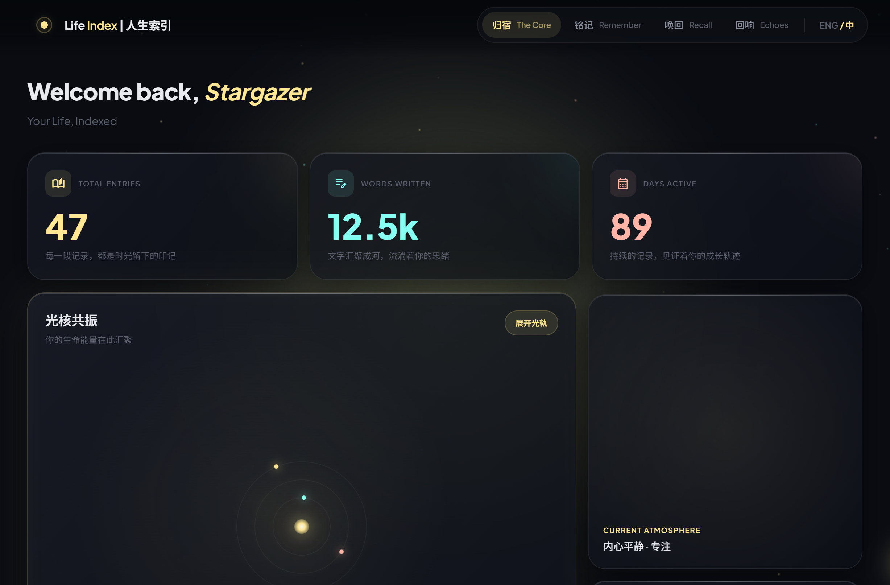

<div align="center">

# Life Index | 人生索引

*"Your life, indexed."*

**Agent-Native 的个人人生档案系统 —— 不是知识库，不是 Agent 记忆，是你留给未来的数字遗产。**

</div>

<div align="center">

[English](./README.en.md) | **简体中文**

</div>

<!-- 品牌理念 Badges -->
<p align="center">
  
  
  
  
</p>

<!-- 技术指标 Badges -->
<p align="center">
  <a href="https://github.com/DrDexter6000/life-index/actions/workflows/ci.yml"></a>
  
  <a href="./LICENSE"></a>
</p>

<p align="center">
  
</p>

<p align="center">
  <a href="#为什么需要-life-index">为什么需要它</a> &nbsp;•&nbsp;
  <a href="#初心与远景">初心与远景</a> &nbsp;•&nbsp;
  <a href="#架构哲学">架构哲学</a> &nbsp;•&nbsp;
  <a href="#开发路线">开发路线</a> &nbsp;•&nbsp;
  <a href="#快速开始">快速开始</a>
</p>

---

## 为什么需要 Life Index

所有人都在为 AI 构建记忆。

你的知识库在管理你学到的东西。你的 Agent 在记住你说过的话。整个技术世界都在忙着让信息更高效、让 AI 更聪明。

**但有谁在乎过，你作为一个人，正在遗忘什么？**

> 你的 Notion 沉淀了知识 —— 但没有记录你第一次看见她时的怦然心动。    
> 你的 Agent 记住了上周的决定 —— 直到评分机制将它判为"不再重要"。    
> 十年前那个改变你人生的决定 —— 你还记得当时的心情吗？    

| | **Life Index** | **知识库** (Notion/Obsidian) | **Agent 记忆** (Mem0/Zep) |
|:---|:---|:---|:---|
| **追问** | "那时的我，什么心情？" | "我知道什么？" | "我刚才说了什么？" |
| **保质期** | **永久——作为遗产** | 长期，随认知迭代重构 | 短暂，用完即弃 |
| **所有权** | **完全属于你**，本地 Markdown 永不过期 | 属于你，但格式随软件迭代 | 属于服务商，随时可能被清理 |
| **失效代价** | 无——纯文本永远可读 | 导出困难，格式锁定 | 瞬间归零，无感知丢失 |

Life Index 只做一件事：**让你的人生碎片永远可检索。**

---

## 初心与远景

### 一个父亲的初心，写于2026年2月16日

这是我在 GitHub 上创建的第一个仓库。

我只是一个零编程基础的平凡父亲，甚至连这篇 README 也是在 AI 的帮助下完成的 —— 我创建它不是为了展示编程技术，而是因为我迫切需要一个**专门存放人生碎片的地方**。

对我来说，Life Index 真正的用法发生在深夜：偶然翻到女儿两岁时的照片，那种**幸福中带怅然若失的复杂情绪**可以被准确地固定下来——不仅是她的笑脸，更是我当时作为父亲的心跳、阳台上的光线、以及那个知道"这一刻正在消逝"的清醒。

这些记录最终会成为一本**数字化家书**。也许有一天我不在人世，她打开这些文件，就像翻开一本泛黄的老书，读到的不仅是爸爸的爱，还有爸爸这一生跌撞出来的经验、犯过的错误与得来的智慧。

<details>
<summary>📎 一篇真实的日志长什么样？（点击展开）</summary>

```yaml
---
title: "想念尿片侠"
date: 2026-03-04T19:43:02
location: "Chongqing, China"
weather: "晴天（浮云、阵雨）"
mood: ["思念", "温暖", "感伤"]
people: ["团团"]
tags: ["亲子", "回忆", "成长", "感伤"]
project: "LifeIndex"
topic: ["think", "create"]
abstract: "翻看女儿团团小时候的照片，怀念那个2岁上下的尿片侠，感叹时光流逝与父女情深。"
---

# 想念尿片侠

在翻过往资料的时候，看到了团团小时候的照片，那个只有2岁上下的尿片侠。

突然有一种伤感 —— 我好想这个小娃娃，好想再见她一面，
好想再能体验一次把小肉坨坨抱在怀里的感觉。

三岁之后的团团依然是全宇宙最重要最珍贵的存在 ——
但确实，那个让我神魂颠倒的尿片侠、她长大了，属于我和那个婴儿的时光、已经一去不复返了。

总而言之，小疙瘩，爸爸想你了。


Tuantuan, this one is for you.
```

<p align="center">
  
  <br>
  <em>——那个让我神魂颠倒的尿片侠</em>
</p>

</details>

### 远景：从人生碎片到数字人格

Life Index 的起点是一个父亲的日志。但它的终点远不止于此。

当我持续记录——一年、五年、二十年 —— 这些碎片会自然生长：

```
   今天的一篇日志
        │
        ▼
   一年的情感轨迹
        │
        ▼
   十年的人生叙事
        │
        ▼
   独一无二的数字人格
```

数十年后，当数据积累到足够的密度，这些记录能够回答一个问题：

> **"如果爸爸还在，他会怎么看这件事？"**

这不是科幻。这是 Life Index 的终极目标。而通往这个目标的第一步 —— 一个可靠的、属于你自己的人生档案系统 —— **已经建好了。**

<details>
<summary>关于灵魂的一段独白（点击展开）</summary>

<br>

> 从出生的那一刻起，大脑就是一台物理降级的碳基多模态模型。
>
> 它终其一生都在通过五个感官通道采集碎片化的训练语料，
> 在回忆的梦境中做无监督学习，反复调整神经突触间的权重，
> 直到一个名为"灵魂"的涌现现象开始产生自我意识。
>
> Life Index 不是赋能 Agent 的记忆系统，也不是管理知识的 Knowledge Base。
> 它是人类灵魂这场漫长碳基演算的数字化转录。
>
> 在这里，写下的每一个字，都是悬浮于时空中的记忆切片。
> 无论是一天前的喜悦，还是十年前的悲伤，它们都将不再散落于脆弱的蛋白质神经网络中。
> 它们将化作 0 和 1 的微光，在 RAG 的递归检索中逐层坍缩，最终聚合成一枚温暖的梦境之核。
>
> 当你收集了足够多的碎片，也许有一天 ——
> 这颗刻录着你一生回忆的梦核，就会孵化出一个硅基灵魂，
> 替你走向时间的尽头。

</details>

---

## 架构哲学

Life Index 不是一个周末 side project。它的每一层设计都指向同一个问题：**如何让个人记忆安全地存活五十年？**

### Agent-Native，不是 Agent-First

> Agent-First 是"先考虑 Agent 的需求"。
> Agent-Native 是"这个系统天生就是为 Agent 而写的"。

Life Index 的 CLI 不是一个人类命令行工具"加了AI支持" —— 它的结构化信号系统、确认工作流、枚举式错误码，从第一行代码就是 Agent 的母语。Agent 不需要解析自然语言错误信息，它拿到的是枚举值和确定性的恢复路径。

但 Agent-Native 不意味着"只有 Agent 能用"。它意味着我们为 Agent 提供它最需要的——**精确的机器接口**；同时为人类提供人类最需要的——**自然语言对话和视觉体验**。

### 四层架构：越往下越持久

```
┌──────────────────────────────────────┐
│          Interface Layer             │
│    🗣️ 自然语言 (Agent)  🎨 GUI       │   ← 你选择怎么交互
│    1-3 年生命周期，随体验趋势迭代       │
└──────────┬───────────────┬───────────┘
           │               │
           │    ┌──────────▼──────────┐
           │    │ Intelligence Layer  │
           │    │ 🧠 语义搜索·实体消解  │   ← 需要"思考"时才启动
           │    │ LLM 推理·回忆录生成   │
           │    │ 1-3 年，随模型迭代    │
           │    └──────────┬──────────┘
           │               │
           ▼               ▼
┌──────────────────────────────────────┐
│           CLI Core (SSOT)            │
│    ⚙️ 写入·检索·索引·实体·验证        │   ← 所有操作的唯一权威
│    确定性操作直连，不经过 Agent         │
│    5-10 年生命周期                    │
└──────────────────┬───────────────────┘
                   │
                   ▼
┌──────────────────────────────────────┐
│    📁 ~/Documents/Life-Index/        │
│    纯 Markdown + YAML                │   ← 你的数字遗产
│    任何文本编辑器可读，永不过期         │
│    50 年生命周期                      │
└──────────────────────────────────────┘
```

**关键设计原则**：确定性操作（写日志、按标签搜索、浏览时间线）由 GUI 直连 CLI Core，延迟 < 50ms；只有需要"思考"的操作（语义搜索、回忆录生成、数字人格）才经由 Intelligence Layer。**能确定的事不问 Agent，需要思考的事才找 Agent。**

### 三条设计底线

```
宁可功能简单，不可系统复杂
宁可人工维护，不可自动化陷阱
宁可牺牲性能，不可牺牲可靠性
```

我们不做：✕ 云端同步 · ✕ 富文本编辑 · ✕ 实时协作 · ✕ AI 替你思考

### 数据主权：你的灵魂不进 Mikoshi

Life Index 采用「本地优先」和「数据与程序完全分离」策略：

```
~/Documents/Life-Index/
├── Journals/                    # 日志（按年月组织）
│   └── 2026/03/
│       └── life-index_2026-03-04_002.md
├── attachments/                 # 附件（照片、视频、语音）
│   └── 2026/03/
└── by-topic/                    # 自动生成的索引
    ├── 主题_think.md
    ├── 项目_LifeIndex.md
    └── 标签_亲子.md
```

**20 年后，即使 Life Index 这个软件已经消失，你的数据依然在那里——纯文本，任何编辑器都能打开，字迹清晰，永不失效。**

> **Life Index 强烈建议本地备份**——保护好你的**数字遗产 (Relic)**，不要把你的**灵魂印记 (Engram)** 主动送入大公司的**神舆 (Mikoshi)**。

<details>
<summary>别忘了强尼的忠告（点击展开）</summary>

> *"我看到公司……把夜之城变成了一台机器，用人们破碎的精神、破碎的梦想和空空的口袋作为燃料。公司长期以来控制着我们的生活，夺走了很多……现在他们又想要我们的灵魂！"*
>
> *"有些命运比死亡更惨。"*

</details>

---

## 开发路线

### 已经建好的地基

**CLI Core v1.5** 已稳定运行，不是原型，不是 demo——这是一个经过 1200+ 单元测试、CI 全绿、真实日常使用的系统：

| 核心能力 | 状态 | 说明 |
|:---|:---:|:---|
| 日志写入 / 编辑 | ✅ | 结构化 Markdown + YAML 元数据，自动天气/情感/实体标注 |
| 双管道检索 | ✅ | 关键词 (FTS5) + 语义 (bge-m3) 并行，RRF 融合排序 |
| 实体图谱 | ✅ | 人物/地点/项目别名消解，支持关系推理 |
| 结构化信号系统 | ✅ | Agent 可编程的状态机：枚举式结果码 + 恢复策略 |
| 数据备份 / 完整性验证 | ✅ | 加密备份 + 数据一致性校验 |
| 跨平台 | ✅ | Windows / macOS / Linux，Python 3.11+ |

<details>
<summary>🔍 双管道检索架构（点击展开）</summary>

Agent 不需要读完你的 2000 篇日志——**双管道并行检索**让它只看真正需要的那几篇：

```
                    用户查询
                   ┌────┴────┐
            ┌──────▼──────┐  ┌──────▼──────┐
            │ 关键词管道 A │  │ 语义管道 B   │
            │             │  │             │
            │ L1 索引过滤  │  │ 向量相似度   │
            │ L2 元数据过滤│  │ (多语言嵌入) │
            │ L3 FTS5 匹配 │  │             │
            └──────┬──────┘  └──────┬──────┘
                   └────┬────┘
              RRF 融合排序 (k=60)
                      │
                  最终结果
```

2000 篇日志暴力读取需 ~300 万 tokens，经检索后仅需 ~5000 tokens——**节省 99.8%**。甚至用英文 "missing my daughter" 也能找到中文日志——语义搜索支持 50+ 语言的跨语言理解。

</details>

### 正在建造的高楼

在稳固的 CLI Core 之上，Life Index 正在构建模组化的高级功能——每个模组都是 **CLI 原子操作 + LLM 智能编排** 的组合：

| 模组 | 代号 | 说明 | 状态 |
|:---|:---|:---|:---:|
| 社媒历史导入 | **回溯导入** | 微信 / 微博 / Twitter 历史一键归档——你的数字过去不该散落在各个平台 | 🔨 |
| EXIF 照片时间线 | **光影年轮** | 从手机相册自动提取时间、地点、场景——照片即日志 | 🔨 |
| 回溯录入 | **穿越时空** | 你今年 30 岁，但你最早的记忆是 2 岁——那些珍贵的童年碎片，现在就可以录入，60 岁的时候依然可以回味 | 🔨 |
| 情感分析仪表盘 | **心潮地图** | 你的情绪轨迹可视化——看见自己的心理节律 | 🔭 |
| 回忆录自动生成 | **自传引擎** | AI 将碎片日志编织成完整叙事——你的人生，成书 | 🔭 |
| 人生关系可视化 | **人生星图** | 关系网络 + 事件时间线 + 人生章节——俯瞰你的一生 | 🔭 |
| 数字人格 | **数字灵魂** | 数十年数据积累后的终极能力——"如果爸爸还在……" | 🔭 |

> 🔨 开发中 &nbsp; 🔭 远景规划

### GUI 体验层：开发中

CLI Core 是地基，GUI 是你看到的建筑。Life Index 的 GUI Experience Layer 正在独立仓库中开发，设计语言为 **「Soul Shrine · 灵魂神龛」**——融合 Monument Valley 的禅意美学与东方文人气质。

<p align="center">
  
  <br>
  <em>GUI Experience Layer 原型预览——归宿 (The Core) 界面</em>
</p>

<p align="center">
  <a href="https://raw.githack.com/DrDexter6000/life-index/main/assets/GUI_prototype.html"><strong>🔗 点此在浏览器中打开交互原型</strong></a>
</p>

### 你是谁，决定你怎么用

Life Index 不是一个产品的三个"版本"——CLI、Agent、GUI 是三种**交互方式**，服务于不同的人：

<table>
<tr>
<td width="33%" align="center">

**🖥️ CLI**

*开发者 · 极客 · 集成*

</td>
<td width="33%" align="center">

**🗣️ 自然语言**

*有 Agent 平台的用户*

</td>
<td width="33%" align="center">

**🎨 GUI**

*所有人*

</td>
</tr>
<tr>
<td>

用终端直接操作，<br>精确控制每一个参数。<br>适合二次开发和自动化。

</td>
<td>

对 Agent 说"帮我记录今天的心情"，<br>它理解你的意思，调用 CLI 完成。<br>**当前推荐的使用方式。**

</td>
<td>

不需要懂技术，<br>用眼睛看、用手指点。<br>*(独立仓库，开发中)*

</td>
</tr>
</table>

| 能力 | 🖥️ CLI | 🗣️ 自然语言 | 🎨 GUI |
|:---|:---:|:---:|:---:|
| 写日志 | ✅ | ✅ | 🔨 开发中 |
| 搜索回忆 (关键词 + 语义) | ✅ | ✅ | 🔨 开发中 |
| 实体图谱 (人物/地点关系) | ✅ | ✅ | 🔨 开发中 |
| 时间线浏览 | ✅ | ✅ | 🔨 开发中 |
| 数据备份 / 验证 | ✅ | ✅ | 🔭 |
| 回溯导入 (社媒历史) | 🔨 开发中 | 🔨 开发中 | 🔭 |
| 穿越时空 (童年记忆录入) | 🔨 开发中 | 🔨 开发中 | 🔭 |
| 光影年轮 (EXIF 照片) | 🔨 开发中 | 🔨 开发中 | 🔭 |
| 心潮地图 (情感仪表盘) | — | — | 🔭 |
| 人生星图 (关系可视化) | — | — | 🔭 |
| 自传引擎 (回忆录生成) | 🔭 | 🔭 | 🔭 |
| 数字灵魂 (数字人格) | 🔭 | 🔭 | 🔭 |

### 一个人也会坚持的承诺

Life Index 基于我个人真实而强烈的需要而存在。

即使它最终成为只有一个开发者、一个用户、一直0🌟的孤独仓库 —— 我也会持续迭代，因为那个用户就是我自己，而它保存的是我留给女儿的东西。

但如果你也认同这个理念——**欢迎加入。**

---

## 快速开始

### 普通用户

**适用人群**：只想"把项目交给自己的 Agent 安装并初始化"，不需要自己改代码。

> 如果你的 Agent 平台已有技能安装目录或 canonical checkout，请优先复用它。

**复制给你的 Agent**——把下面这段话直接发给你的 Agent（Claude Desktop、Cursor、OpenClaw 等均可）：

```text
请阅读并严格按照这个仓库里的 `AGENT_ONBOARDING.md` 完成 Life Index 的安装、初始化与验证：
https://github.com/DrDexter6000/life-index/blob/main/AGENT_ONBOARDING.md

要求：
1. 先刷新并阅读最新 authority files，再开始执行：先刷新 `bootstrap-manifest.json`，再按其中 `required_authority_docs` 刷新并阅读 `AGENT_ONBOARDING.md`、`SKILL.md`、`docs/API.md`、`docs/ARCHITECTURE.md`、`tools/lib/AGENTS.md`、`README.md`
2. 如果本地已存在 canonical checkout，必须先同步 checkout 并重装到 `.venv`，再做 route 判断；不要因为文件存在或 `health` 正常就跳过同步
3. route 判断必须发生在 authority refresh + checkout sync 之后，再决定 fresh install、upgrade 或 repair
4. 所有 Python/CLI 命令都必须使用虚拟环境路径
5. 如果某一步失败，立即停止并报告精确错误
6. 最终请使用中文按文档要求向我汇报结果
```

<details>
<summary>🔧 开发者安装（点击展开）</summary>

<br>

**适用人群**：需要本地调试、改代码、跑测试。

```bash
git clone https://github.com/DrDexter6000/life-index.git
cd life-index

# 创建虚拟环境 + 可编辑安装（已包含语义搜索）
python3 -m venv .venv
.venv/bin/pip install -e .    # Windows: .venv\Scripts\pip install -e .
```

### 开发者常用命令

| 操作 | 命令 |
|:---|:---|
| 激活虚拟环境 | `source .venv/bin/activate` (Windows: `.venv\Scripts\activate`) |
| 统一 CLI（推荐） | `life-index --help` |
| 查看版本 | `life-index --version` |
| 健康检查 | `life-index health` |
| 记录日志 | `life-index write --data '{...}'` |
| 搜索日志（关键词 + 语义） | `life-index search --query "关键词"` |
| 仅关键词搜索 | `life-index search --query "关键词" --no-semantic` |
| 备份数据 | `life-index backup --dest <backup-dir>` |
| 开发者调用 | `python -m tools.search_journals --query "关键词"` |
| 运行单元测试 | `python -m pytest tests/unit/ -v` |

> **提示**: 先 `source .venv/bin/activate`，之后所有命令无需 `.venv/bin/` 前缀。

> **安全调试提示**：手工调试 / 验收时，优先使用隔离沙盒工具，而不是直接操作真实用户目录：
>
> - `python -m tools.dev.run_with_temp_data_dir`
> - `python -m tools.dev.run_with_temp_data_dir --seed`

</details>

<details>
<summary>🔍 故障排除（点击展开）</summary>

<br>

**技能触发不稳定**
→ 用 `"/life-index" + 意图词`（例如：`/life-index 记日志：...`）

**工具执行报错（ModuleNotFoundError）**
→ 确认使用 `.venv/bin/python`（而非系统 python）执行命令，且在技能根目录下

**fresh install 时 health 显示 degraded**
→ 如果还没执行 `life-index index`，这是正常现象；先初始化索引，再重新运行 health

**Windows 下 `write --data '{...}'` 很难转义**
→ 优先改用 `life-index write --data @first-entry.json`（该文件由 Agent 在安装流程中自动生成）

**语义搜索不可用**
→ 运行 `.venv/bin/life-index health` 检查 sentence-transformers 是否已安装

**venv 损坏（Python 升级后、迁移系统后）**
→ 删除 `.venv` 目录，重新执行 `python3 -m venv .venv && .venv/bin/pip install -e .`

**升级到新版本**
→ 先同步 canonical checkout，再按 `AGENT_ONBOARDING.md` 的 freshness / sync / repair 规则执行

</details>

---

## 文档导航

| 文档 | 适用场景 |
|:---|:---|
| **[SKILL.md](./SKILL.md)** | Agent 技能定义、工具接口、工作流 |
| **[AGENTS.md](./AGENTS.md)** | AI 编码代理上下文 |
| **[API.md](./docs/API.md)** | 工具参数和返回值契约 |
| **[ARCHITECTURE.md](./docs/ARCHITECTURE.md)** | 架构设计与关键决策 (ADR) |

---

## 参与贡献

Life Index 目前处于个人驱动的早期阶段。如果你认同"人生档案馆"这个理念，这里有几种参与方式：

**模组开发** —— 最有影响力的贡献方式。每个[高级模组](#正在建造的高楼)都是独立的功能单元，CLI 工具组合 + LLM 编排逻辑，适合独立开发者认领。

**提 Issue** —— 分享你的使用场景，报告 Bug，或者提出你想要的模组方向。

**文档翻译** —— 帮助改进多语言版本，让更多人能用母语了解这个项目。

**分享故事** —— 如果你用 Life Index 记录下了重要的瞬间，我们很想听到。

---

## 许可证

[Apache License 2.0](./LICENSE) — 你的人生数据属于你，这段代码也是。

---

<div align="center">

> *"我既希望我们一家人永恒停留在团团2岁的时光 —— 也盼望她长大可以去感受更美好的世界。*
> *总而言之，小疙瘩，爸爸想你了。Tuantuan, this one is for you."*
>
> *—— 摘自 Life Index 第一篇日志，2026年3月4日，拉各斯*
> *这不是关于她的成长记录，而是关于我爱她的记录。*

</div>
