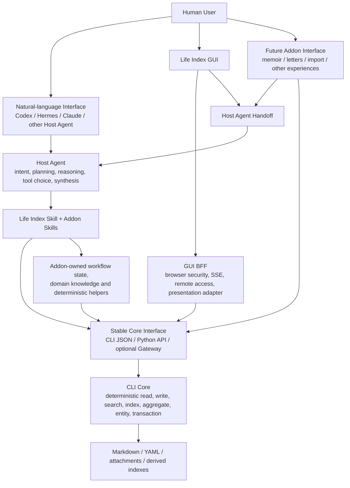

# Life Index Platform 双仓与 Addon 架构设计

> 状态：Human Owner-ratified design background; accepted decisions are being absorbed into existing SSOT; not active SSOT; D0 exact §1.10 closed-domain list remains pending Human Owner substantive approval
>
> 日期：2026-07-09
>
> 范围：`life-index` 主仓、配套 GUI 产品仓及未来高级 Addon
>
> 决策层：Human Owner、CTO / Product Director、Chief Advisor
>
> 执行层：CLI Lead Agent、GUI Lead Agent、未来 Addon Lead Agent

## 0. 文档地位

本文是跨仓设计提案，不是已生效的产品宪章或 API 契约。

在完成 Chief Advisor 红队评审、CTO / Product Director 裁定和 Human Owner 批准前，权威顺序保持不变：

1. CLI `CHARTER.md`；
2. 两仓各自 `AGENTS.md`；
3. CLI `docs/API.md` 与 `docs/ARCHITECTURE.md`；
4. GUI 的公开架构与接口契约；
5. 本设计提案。

若本文与现有权威文档冲突，评审阶段以现有权威文档为准，并把冲突列入后续正式变更，而不是静默覆盖。通过终审后，主控 Agent 应把被接受的决策提升到现有权威 SSOT；本文随后保留为决策背景，不成为并行维护的长期 SSOT。

### 0.1 Revision 2 说明

本轮修订吸收 Chief Advisor Round 1 中经代码与治理文档核实的意见，并保留两项事实校正：

1. eval 体系确实把“noise query 应返回 0”编码为质量目标，但公开 GitHub `search-eval-gate` 在缺少私有 Gold Set 时会跳过相关模块；问题不是“公开 CI 必然阻止修复”，而是私有/本地评估期望、宪章质量门和公开 hard-check 声明不一致。修复必须同时更新搜索行为、评估语义和公开可执行的不变量测试。
2. 写入不是“完全没有事务”，但风险也不止两个窗口：附件复制、legacy index/摘要更新发生在 journal commit 前；metadata relation 更新发生在 commit 后且异常可形成“文件已写但返回失败”。P0 因此改为收口具体原子性缺口，而不是重造整套写入系统。

### 0.2 Revision 3 说明

Round 2 确认 Revision 2 无结构性返工，只需关闭五类边界漏洞。本轮同时保留一项事实校正：`mark_pending` 失败会被吞掉且状态可报 `COMPLETE`，但当前仓内没有 pending queue 的消费方，默认 `write` 也不启用 `--auto-index`。因此第五类问题不是一个孤立异常分支，而是索引新鲜度执行、pending 机制与状态上报已经脱节。

## 1. Executive Decision

Life Index 的目标形态不是“一个 CLI 产品加一个 GUI 产品”，而是一个本地优先的个人记忆平台：

- CLI Core 保存事实、执行确定性操作并提供长期稳定契约；
- Host Agent 理解自然语言、规划、推理、选择工具和合成；
- Skills 承载 Life Index 及 Addon 的领域流程；
- GUI 是一等的第一方人类体验层，而不是智能所有者；
- 未来 Addon 通过同一 Core Contract 和 Host Agent 生态生长；
- Gateway 与 Host Runtime Layer 复用连接和运行时能力，但不成为新的智能或数据真相源。

关键边界：

> `life-index` 主仓可以发行 Core、Contracts、Skills、Gateway 和共享 Host Runtime 接入资产；但同仓不等于同层。高波动的 Agent / runtime 能力不得进入 CLI Core。

## 2. 设计目标与非目标

### 2.1 目标

1. 同时支持自然语言 Agent 与 GUI 两条一等人类入口。
2. 为 GUI、Host Agent 和未来 Addon 提供可随项目成长、但相对稳定的 Core Interface。
3. 避免每个 Addon 重复实现 CLI 调用、Host runtime 连接、流式、取消、错误与 provenance。
4. 保持用户数据只有一个权威写入路径，不因 Gateway、GUI 或 Addon 产生平行数据语义。
5. 允许经真实复用验证的确定性 Addon 基元回流 CLI Core。
6. 把当前 CLI / GUI 审计发现的可信性与激活问题排在平台扩张之前。

### 2.2 非目标

1. 本设计不批准立即实现 Gateway、Addon SDK 或新 Addon。
2. 本设计不选择具体 Host Agent、模型、provider 或云服务。
3. 本设计不引入 plugin loader、动态 entry-point registry 或自动执行未知 Addon。
4. 本设计不把自然语言规划、语义解释或叙事合成放入 CLI Core。
5. 本设计不要求立即拆出第三个仓库或独立发行所有 runtime adapter。
6. 本设计不把 GUI 降格为次要产品；“逻辑上是 L4 模块”不等于“产品上不重要”。

## 3. 目标架构



### 3.1 两条一等人类入口

**自然语言路径**：Human → Host Agent UI → Host Agent → Skill → Core Interface → CLI Core。

**GUI 路径**分两种：

- 确定性动作：Human → GUI → BFF → Core Interface → CLI Core；
- 智能动作：Human → GUI → Handoff → Host Agent → Skill → Core Interface → CLI Core，结果再由 GUI 呈现。

两条路径使用同一数据真相源、同一确定性工具和同一领域 Skill。不得出现“Agent 版传记”和“GUI 版传记”两套智能实现。

## 4. 层与所有权

| 层 / 组件 | 拥有 | 不拥有 | 主要位置 |
|---|---|---|---|
| L1 Data | journal、YAML、附件、机器派生索引 | 解释、叙事、UI 状态 | 用户数据目录，由 CLI 约束 |
| L2 CLI Core | 确定性读写、检索、聚合、entity、事务、schema 语义 | LLM、Host runtime、自然语言规划、GUI | `life-index` 主仓 Core |
| Core Contract | JSON shape、字段语义、错误码、SLO、副作用与版本 | 独立业务逻辑 | `life-index` 主仓 |
| Tool Gateway | Core Contract 的 1:1 transport projection | 新能力、新写入路径、语义修复、智能 | 主仓可选 adapter，不属于 Core |
| Host Runtime Layer | runtime 连接、启动、健康、流式、取消、超时、严格 envelope | 模型选择、意图分类、工具规划、答案合成 | 可由主仓发行；runtime adapter 可独立版本化 |
| Skills | 领域流程、检索策略、证据使用规则、Addon procedure | 数据真相源、隐式 provider | 主仓通用 Skill + Addon Skill |
| Host Agent | 意图、规划、推理、多工具调用、语言合成 | 绕过 Core 写 L1 | 用户选择的 runtime |
| GUI | 写入/搜索/证据/时间线等人类体验，浏览器安全与 presentation | 数据语义、LLM brain、runtime 宽松修复 | 配套 GUI 产品仓 |
| Addon | 领域知识、工作流状态、专用 helper、可选 renderer | 平行 L1、Core 内部实现假设 | 独立包、目录或仓库 |

## 5. `life-index` 主仓与 CLI Core 的区别

`life-index` 应被视为 Life Index Platform 的主仓；CLI Core 是其中寿命最长、依赖最少的内核。此为产品和架构心智模型，不要求立即修改仓库名称。

主仓长期可以拥有：

- CLI Core；
- API schema 与 capability registry；
- Python client / Addon SDK 的确定性部分；
- `SKILL.md` 与通用领域 Skills；
- Tool Gateway；
- 严格 Host Runtime 接入协议与 conformance；
- evidence、claim、provenance、run-context 等跨 Addon 类型。

依赖方向必须保持：

```text
Core <- Core Contract <- Gateway / SDK <- GUI / Addon / Host Agent

Core must not depend on Gateway.
Core must not depend on Host Runtime.
Core must not depend on GUI or Addon.
```

物理同仓不能成为反向依赖或把 Agent 逻辑放进 Core 的理由。

## 6. Stable Core Interface

### 6.1 稳定承诺

Addon、GUI 和 Host Agent 可以依赖：

1. JSON 顶层 shape 与类型；
2. 字段的精确语义和枚举；
3. 错误码、诚实降级和 `recovery_strategy`；
4. 关键 SLO；
5. side-effect 分类：read-only、proposal、write、maintenance；
6. 写入原子性和幂等语义；
7. capability/schema version 与兼容策略。

消费者不得依赖 SQLite 表、索引文件布局、分词配置、内部 Python 私有函数或历史兼容分支。

### 6.2 Capability Registry

当前不存在可直接生成完整 registry 的单一机器权威。Round 1 核验时，统一 CLI command map 有 29 个顶层 route，而仓内共有 10 个 `schema.json` 文件；`docs/API.md` 仍包含大量人工维护的契约散文。这些数字只是当前快照，但足以证明“先生成 registry”会制造第二 SSOT。

因此 registry 工作必须按“权威先行”顺序执行：

1. 盘点所有公共 route、子命令、schema、兼容 flag 和实际输出；
2. 为每个公共能力确定 canonical machine contract，并补齐缺失 schema；
3. 用 contract tests 对拍 schema、CLI 实际输出和错误行为；
4. 决定 `docs/API.md` 哪些章节由权威定义生成、哪些由 CI 校验而保留人工解释；
5. 最后从该权威定义生成或校验 registry。

完成地基后，机器可读能力目录中的每个能力至少声明：

- canonical name；
- input/output schema version；
- side-effect class；
- required confirmation / lock / audit 行为；
- minimum CLI version；
- availability / feature negotiation；
- recovery semantics；
- direct CLI invocation mapping。

Registry 必须从 CLI 权威定义产生，不能手工绕过生成/校验链修改。若提交生成物，CI 必须对拍 drift；若不提交生成物，则 release 构建必须可复现地产生它。

### 6.3 Gateway

Gateway 只允许是 Core Contract 的精确投影：

- 返回 CLI 原始 JSON 语义；
- 所有写入经过同一 validation、lock、transaction 和 audit；
- 不直接读写用户数据；
- 不拥有 schema；
- 不做 query rewrite、tool choice、semantic coercion 或 synthesis；
- 不成为 CLI 的强制常驻依赖。

初始技术顺序是 capability registry → transport-neutral dispatcher → stdio/JSON-RPC pilot。HTTP 或 MCP 只有在第二个真实消费者、连接复用、流式或宿主约束证明需要时才进入实现评估。

## 7. Shared Host Runtime Layer

### 7.1 应复用的轮子

共享层可以统一：

- runtime 的显式配置与健康检查；
- 启动、停止、timeout、cancel；
- status/delta/final/error 流式事件；
- strict envelope validation；
- request/run/conversation correlation；
- 诊断、可观测性和敏感内容脱敏；
- conformance kit 与兼容支持矩阵。

### 7.2 禁止成为“Life Index 大脑”

共享层不得：

- 判断用户要运行哪个 Addon；
- 选择模型或 provider；
- 改写 query；
- 决定工具调用序列；
- 修复或重写 Agent 的语义结论；
- 生成传记、家书、诊断或人格表达；
- 为了兼容任意 stdout 而无限添加通用 heuristic。

Domain Skill 提供 procedure；Host Agent 执行 reasoning；Host Runtime Layer 只承担连接与传输。

### 7.3 当前 bridge 的处置

当前 GUI reference bridge 在 P2 前保持可用，但立即冻结新的通用宽松 heuristic。后续按真实变更拆成：

1. strict reference adapter；
2. 具名 runtime adapter；
3. GUI-owned handoff relay 与 renderer。

不把现有 bridge 整体搬入 CLI Core，也不为减少进程数而合入 GUI backend。

### 7.4 Prompt 与指令资产归属

当前 GUI bridge 的 prompt 同时混合领域 procedure、GUI 呈现偏好、handoff envelope 和 runtime 方言。拆分时按知识所有者归位：

| Prompt 内容 | Owner |
|---|---|
| 工具选择、检索顺序、证据规则、领域 procedure | Life Index / Addon Skill |
| GUI 字数、分区、可点击证据、交互建议 | GUI 请求方 / presentation contract |
| JSON/SSE envelope、schema version、wire-format 约束 | Handoff contract / strict adapter |
| 某个 runtime 的命令语法、prompt 注入方式、终端 framing | 具名 runtime adapter |

Shared Host Runtime Layer 不自带默认领域 prompt。具名 adapter 可以把调用方提供的 prompt/Skill 资产作为数据装载，但不得重写其语义策略。

具名 adapter 的资产组装顺序、长度预算、语言选择与截断优先级必须是其支持矩阵中声明的确定性规则。发生截断时，envelope diagnostics 必须报告被截断的资产类别和原因，不得静默改变领域或证据策略。稳定的 GUI presentation 约束（如 locale、长度上限、结构化 section 偏好）应优先作为请求契约字段传入；自由文风仍可作为内容指令，不强迫所有呈现偏好 schema 化。

### 7.5 打包与默认安装面

即使 Gateway 或 runtime adapter 与 Core 同仓，Core 默认安装面也必须零增重：

- Core 不因可选 adapter 增加 LLM SDK、runtime SDK 或服务依赖；
- adapter 使用独立 distribution 或显式 extras；
- adapter 导入/依赖失败不得影响 `life-index write/search/verify` 等 Core 路径；
- 具体选择在 P2 用打包与升级证据裁定，不以“同仓方便”为理由合并 wheel。

## 8. Addon 模型

### 8.1 标准组成

一个高级 Addon 可以包含：

```text
addon/
├── SKILL.md             # 领域 procedure
├── references/          # 领域知识
├── helpers/             # 确定性 helper
├── schemas/             # Addon 产物与过程状态
├── renderer/            # 可选 GUI 呈现
└── state/               # 可重建的 module-local checkpoint/cursor
```

Addon 不要求同时拥有全部部分。简单体验可以只有 Skill；导入器可以主要由 deterministic adapter 构成；富体验可以增加 renderer 与 checkpoint。

### 8.2 基元升格规则

本设计不另建一套与 `CHARTER.md §1.10.5` 并行的升格规则。终审前，现行宪章仍是唯一权威。

本文提议通过正式宪章修订精化 §1.10.5，而不是在设计稿中长期自持六规则。拟议精化只有三点：

1. Human Owner 的书面判定只能替代“已有第二个生产消费者”这一项，不能豁免确定性、低 LLM、长期语义稳定和 RFC 证据；
2. 升格 RFC 必须定义封闭的 Core admission domains，不得使用“密切相关”作为自由裁量词；初始 domains 应从现有 §1.10 职责中枚举，新增 domain 本身需要 Human Owner substantive approval；
3. RFC 必须包含 falsifier、回滚/降级路径、schema、SLO、错误与回归证据。

在该修订获 Human Owner 批准并进入 `CHARTER.md` 后，本节只保留指针。最终 domain 清单由宪章 RFC 决定，不在本设计稿中抢先成为第二 SSOT。Whole-feature promotion 不是默认路径；通常只有确定性基元回流 Core。

### 8.3 示例裁定

| Addon | Core 候选 | 留在 Addon / Skill |
|---|---|---|
| 数字传记 | timeline、evidence pack、batch/cursor、素材分桶 | 章节立意、人生解释、叙事文风 |
| 数字家书 | 人物关系、时间范围、引用与素材包 | 情感表达、语气与价值判断 |
| 心理分析 | typed observation、量表计算、来源引用 | 诊断、心理解释和建议 |
| 模拟人格 | 语料检索、引用、风格统计 | 人格模拟、角色表达、身份声明 |
| 相册/社媒导入 | 已有 import plan/run/status/rollback；未来可评估 hash/dedup、时间归一化、provenance 基元 | 平台登录、抓取、API 方言和格式 adapter |

## 9. 数据、错误与安全边界

1. 所有 durable 用户数据写入必须由 CLI Core 执行。
2. GUI、Gateway、Host Runtime 和 Addon 不直接写 journal/frontmatter/索引文件。
3. Addon checkpoint/cursor 属于 module-local、可清除、可重建过程状态，不得成为第二真相源。
4. Host Agent 不可用时，确定性写入、搜索和浏览继续可用；智能入口诚实显示 unavailable。
5. Runtime adapter 不得静默选择 provider 或外发用户数据。
6. 需要云模型时，由用户选择的 Host Agent 负责 provider、凭据、授权和数据暴露说明。
7. Agent 输出评价是 advisory metadata，不作为阻断或改写闸门。
8. 所有跨边界请求携带 version、request/run id 和可诊断错误；未知 additive 字段应前向兼容。

## 10. 方案比较

| Option | 优化目标 | 代价 | 裁定 |
|---|---|---|---|
| Conservative path：每个 Addon 自带 Agent/bridge | 局部自治、最少平台设计 | runtime、错误、流式、schema 重复；协议漂移 | 拒绝作为长期模型 |
| Core orchestrator：统一自然语言大脑进入 CLI Core | Addon 表面最简单 | Core 绑定模型、隐私、runtime 和高波动语义；破坏寿命分层 | 拒绝 |
| Clean target：立即拆分 Core/Gateway/Runtime/Addon 多发行物 | 边界最整洁 | 当前激活和版本协调成本过高 | 终局参考，不一次性执行 |
| **Staged clean path：同仓不同层，先修 Core/激活/契约，再由真实消费者触发 Gateway 与 Runtime 抽取** | 长期边界与当前节奏 | 需要阶段纪律，短期保留过渡结构 | **推荐** |

## 11. Red-Team / Blue-Team

### 11.1 共享 Runtime Layer 偷偷变成智能层

- **Red**：未来开发者为方便在 runtime 层加入 intent router、prompt policy 和 tool planner。
- **Blue**：接口只允许调用方提供 task/context/tools；增加依赖边界测试，禁止 Core 和 transport 层导入 provider/LLM client；语义策略只能存在于 Skill/Host Agent。
- **Residual**：runtime-specific adapter 仍可能需要方言处理，因此必须具名和独立支持，而不是伪装成通用协议。

### 11.2 Gateway 成为第二 API

- **Red**：HTTP/MCP 逐步新增 CLI 没有的字段、错误和写入快捷路径。
- **Blue**：registry 由 CLI 权威定义生成；建立 direct CLI vs Gateway contract-equivalence tests；Gateway 不拥有 schema 文件。
- **Residual**：transport-specific framing 与连接错误仍存在，但不能改变领域语义。

### 11.3 Core 为未来 Addon 过度膨胀

- **Red**：以“将来多个模块也许需要”为由提前加入 workflow primitives。
- **Blue**：执行现行 `CHARTER.md §1.10.5`；若拟议精化获批，Owner 判定只能替代第二消费者证据，其他条件仍强制，默认留在 Addon。
- **Residual**：可能短期出现两份相似 helper；这比长期污染 Core 更容易回收。

### 11.4 拆分增加用户安装负担

- **Red**：Gateway、runtime adapter、GUI、Addon 形成多进程和多版本拓扑。
- **Blue**：默认核心路径保持 CLI + Skill；AI+ 和 Gateway 都是可选；激活 Skill 隐藏拓扑并运行版本协商/conformance。
- **Residual**：高级体验仍有本地运行时复杂度，必须用真实冷启动数据决定是否进一步打包。

### 11.5 质量指标保卫错误行为

- **Red**：某轮为提高 noise rejection 或 precision 引入结果删除，随后 Gold Set 和基线把该行为冻结成“质量”，未来 recall-first 修复反而被判退化。
- **Blue**：把 token-match 完整性做成公开 synthetic 不变量硬测试；ranking/noise eval 只报告质量，不得覆盖不变量；任何基线语义反转与搜索修复同一 work package 落地。
- **Residual**：私有真实数据仍可能诱导过拟合，因此公开代码和注释不得携带私有语料标题或事实。

### 11.6 战略裁定沉没

- **Red**：架构已经裁定退役某能力，但没有 tracked work item、Owner、验收和 CI 绊线，数月后死契约仍留在生产代码。
- **Blue**：每项 P0/Tier C 裁定在批准时同时建立执行 owner、证据门和可检查状态；终审 SSOT 收编完成前，设计稿不得宣告退役。
- **Residual**：机器门只能防已知回归，仍需要 CTO/Advisor 定期检查“已裁定未执行”的治理债。

### 11.7 副作用执行与状态上报双清单漂移

- **Red**：新增一个副作用步骤时只更新执行路径，忘记更新 `side_effects_status` 汇总；系统继续返回 `COMPLETE`，但索引、新鲜度或派生产物已失败。
- **Blue**：每个副作用产生同一结构化 execution record，最终状态由 records 聚合，失败/跳过/未执行均可见；不得另写手工布尔清单推断完成度。
- **Residual**：历史调用者可能依赖粗粒度状态，迁移时需保留兼容字段并新增明细，而不是原地改变旧枚举语义。

## 12. 双仓统一优先级

### P0 — Core Truth and Safety

在任何 Gateway、bridge 搬迁或新 Addon 前完成：

1. **Recall-first 与 eval 同改**：
   - 默认搜索不得因预设 OOD/noise 主题、FTS/ranking threshold 或置信度策略删除真实 token match；
   - OOD、否定意图和噪声判断只能成为 advisory metadata，不能整管道 bypass；
   - 同一 work package 重写本地/私有 Gold Set、公开单元/契约测试以及所有断言 rejection 行为的 expectation，不能让旧测试继续保卫错误行为；
   - 在公开 CI 增加 synthetic token-match 完整性硬测试，并让 `docs/CI_HARD_CHECKS.md` 准确反映哪些质量门在公共 checkout 真正执行；
   - 任何标为 Tier-1 blocker 的公开 job 必须有可执行的 synthetic 核心断言并证明至少执行一项；若核心断言全部依赖私有资产而 skip，该检查不得以绿色 blocker 冒充已执行，只能明确标记为未执行/advisory；
   - 删除公开代码中来自私有语料调参的标题/事实注释，并把 synthetic-only eval/public-surface privacy review 纳入验收。
2. **可复现检索地基**：建立公开 synthetic/sandbox retrieval baseline；私有真实数据 eval 继续作为 advisory evidence，不成为公共项目唯一可执行的正确性证明。
3. **收口具体写入原子性缺口**：保留现有 temp file、atomic rename、pending、Data Doctor 和 `side_effects_status` 资产，重点处理：
   - journal commit 前复制的附件在失败后成为孤儿；
   - legacy topic/project/tag index 的顺序写入可能部分成功，且可引用尚未 commit 的 journal；
   - 月度摘要/派生文档在 journal commit 前刷新，成功写入后仍可能缺失新 journal；
   - journal commit 后 metadata relation 失败可造成文件已落盘但调用返回失败。
   - `mark_pending` 失败被吞掉，pending queue 又没有仓内消费方，默认 write 不自动索引，但 `index_status` / `side_effects_status` 仍可能报告 `COMPLETE`；必须重新明确索引新鲜度 owner 和 honest status。
   通过故障注入证明不存在孤儿附件、半更新索引、错误 stale-success 或 committed-but-reported-failed。执行过的副作用与状态汇总必须来自同一份结构化记录，不能继续维护两份手工清单。
4. **执行已裁定的 in-tool LLM 退役**：以 APEX“工具非智能”和“评价仅咨询”为依据，删除或隔离生产 smart-search 模块中的 `LLMClient`、prompt parser、trust gate 和 legacy synthesis，只保留必要的确定性 scaffold。`--synthesize` 先成为文档化 deprecated no-op，至少保留两个主版本后再移除；`docs/API.md` 的 Answer Synthesis/trust-gate 契约在同一变更中改写，并增加搜索生产路径禁 LLM/provider 符号的 CI 绊线。
5. **备份恢复演练**：在纯 sandbox 中执行 backup → restore 到空目录 → 重建派生索引 → `verify`，覆盖 journals、attachments、entity graph 和可重建 `.index`。已有 backup/restore 单元测试不替代该端到端灾难恢复证据。
6. **裁定落地防遗失**：每项 P0 在批准时建立可追踪 work item、验收证据和对应机器绊线；“已裁定但未执行”作为治理债显式呈现。

P0 的验收标准是行为正确、契约诚实、回归可复现，不是只让 CI 变绿。

### P1 — Product Activation and Contract Truth

1. 新机器在 Host Agent 协助下，10 分钟内安装、验证、打开 GUI、写入第一条日志并搜索到它；至少三个独立样本，其中至少一个 Windows 真机。
2. 激活验收增加可选“带着历史进来”支线：使用已有 import plan/run/status/rollback 导入一批 sandbox 既有数据并搜索到它，不新增第二套导入系统。
3. AI+ unavailable 不阻塞确定性核心循环。
4. 修正 GUI attachment contract 与真实 CLI feature negotiation 漂移。
5. 清理过期 SSOT、无退出条件的兼容分支和未实现未来 UI 卡片；终审收编时同步修正 GUI 锚定文档中已经失效的 semantic/vector 表述。
6. release gate 增加真实 CLI + backend + browser smoke，覆盖最高风险跨进程链路。
7. 执行 §6.2“权威先行”五步，先补全/对拍 canonical machine contract，再生成或校验 capability registry。

### P2 — Platform Interface

1. 定义 Addon Contract 与 deterministic Addon SDK 最小面。
2. 定义 Shared Host Runtime Layer 的 strict contract。
3. 按 §7.4 将 prompt 的 domain、presentation、wire-format 与 runtime 方言知识分别归位。
4. 冻结并分型当前 reference bridge；不再把 runtime 方言修复称为通用 adapter。每个具名 adapter 必须有真实用户、维护责任、conformance、支持矩阵与退出条件。
5. 决定独立 distribution 或 extras，但默认 Core 安装面零增重。
6. 定义跨组件升级故事：各组件保留自己的 deterministic plan/apply owner，由 Host Agent 按一份版本协商/runbook 编排；不创建能绕过各组件安全门的“超级升级器”。
7. 以 `health`、`read`、`search` 做 stdio/JSON-RPC Gateway pilot。
8. 验证 direct CLI 与 Gateway 的输出、错误、权限和 side-effect 语义等价。
9. frontend 仅在真实 feature change 触及时按 vertical slice 深化，不为拆文件而拆文件。

### P3 — First Architecture-Proving Addon

首个建议候选是只读、带逐条引用、可暂停恢复的“个人传记单章节”MVP。它用于验证长程检索、evidence、batch/cursor、Addon Skill、Host Agent 调度、GUI 富呈现和双入口一致性。

心理诊断和模拟人格不作为第一个平台验证 Addon：二者的高风险解释、身份、安全和产品责任会掩盖基础架构问题。

Memoir 立项必须同时满足：P0/P1 通过、公开 token-match 完整性门为绿、至少一次 owner-authorized grounded query 产物可由磁盘 evidence id 独立核验。未满足时不得以展示或“灵魂功能”理由抢跑。

## 13. Verification Gates

任何阶段的“完成”必须由与风险相称的证据支持：

1. **Core boundary**：L2 不导入或初始化 LLM/provider/runtime client。
2. **Data boundary**：GUI、Gateway、Addon 不直接写 L1。
3. **Contract authority**：schema、CLI 实际输出、API 文档和 registry 不允许出现未解释 drift。
4. **Contract equivalence**：同一输入经 direct CLI 和 Gateway 具有等价领域结果与错误语义。
5. **Transaction and freshness**：故障注入证明失败后不存在孤儿附件、半更新索引、虚假 success 或 committed-but-reported-failed；索引新鲜度 owner 明确，side-effect 状态由实际 execution records 聚合。
6. **Recall**：公开 synthetic 测试断言真实 token match 不被默认 gate/threshold 删除；私有 eval 只能补充证据。
7. **Disaster recovery**：backup → empty restore → rebuild → verify 的 sandbox 演练通过。
8. **Activation**：至少三个独立冷启动样本完成 10 分钟首条日志闭环，其中至少一个 Windows；import 支线单独记录结果。
9. **Host-agent outcome**：Agent-facing 变更按当前 `SKILL.md` 在 owner-authorized 数据上完成真实任务，而非只跑单元测试。
10. **Addon proof**：同一个 Addon Skill 可从自然语言入口和 GUI 入口产生同源 evidence 与兼容产物。

## 14. 决策与执行 Operating Model

### 14.1 角色

| 角色 | 职责 | 不负责 |
|---|---|---|
| Human Owner | 最终产品意图、风险接受、重大方向批准 | 日常代码细节 |
| CTO / Product Director | 目标模型、产品优先级、架构边界、跨仓裁定、执行验收标准 | 日常实现和主控 Agent 的具体编码 |
| Chief Advisor | 平级战略伙伴；获取完整上下文，独立判断，提出创意、红队挑战和参考审计意见 | 迎合既有方案、代替主控 Agent 写实现方案或代码 |
| CLI Lead Agent | CLI 任务分解、TDD/实现、验证、提交与证据报告 | 自行改变高维产品/架构方向 |
| GUI Lead Agent | GUI 任务分解、实现、浏览器验收、契约协同与证据报告 | 自行改变高维产品/架构方向 |
| Addon Lead Agent | 被批准 Addon 的具体设计与实现 | 修改 Core 边界或绕过升格流程 |

### 14.2 决策流程

流程按爆炸半径分层，避免把 CTO / Advisor 变成所有小改动的串行瓶颈：

| Tier | 典型范围 | 决策与执行 |
|---|---|---|
| A — Routine / Reversible | 小型文档、卫生、已批准边界内的单文件修复、低风险机械工作 | 主控 Agent 按 `AGENTS.md` 自主执行、聚焦验证、报告证据；无需前置审批；CTO/Advisor 每周期抽样复核 Tier 自报与结果 |
| B — Scoped Product / Contract Work | 跨模块但仍在已批准战略内的功能、契约实现、复杂 bug、激活改进；已批准契约族内的 additive 向后兼容字段 | CTO / Product Director 给目标与验收边界；主控 Agent 写具体方案/TDD并执行；Advisor 按风险抽查，包含 Tier 判定本身 |
| C — Strategic / Irreversible | 宪章、新 schema version、breaking API/schema、eval baseline/golden expectation 语义变更、数据边界、安全、兼容删除、新 Addon、release/tag/push/go-live、重大仓库/发行边界 | 完整 CTO 提案 → Advisor red-team → CTO adjudication → Human Owner 批准 → 主控 Agent执行 → 双方证据复核 |

Tier 由 blast radius、可逆性和公共承诺决定，不由文件数量决定。Tier 按一组关联变更的累积效果判断：若切分后的多个 A/B 变更合并效果触及 C 范围，整组按 C 处理。无法确定 Tier 时按高一级处理，但只读调查永远不因缺少战略审批而禁止。

无论 work item 自报何种 Tier，tag、公开 push、release、PyPI 发布和 go-live 等不可逆动作都必须经过 Chief Advisor 或 CTO 指定的独立 preflight；Tier 标签不能成为绕过不可逆门的依据。

Tier C 的完整流程：

1. CTO / Product Director 形成高维提案与验收边界。
2. Chief Advisor 获取必要上下文并进行独立 red-team；不默认同意 Owner 或 CTO。
3. CTO / Product Director 对建议逐项 adjudicate：接受、修改后接受或有理由拒绝。
4. Human Owner 批准方向、优先级和不可逆风险。
5. CTO / Product Director 为对应主控 Agent 提供复制用执行 prompt；长程任务附经批准的 spec、goal 或 TDD 要求。
6. 主控 Agent 负责具体方案、代码、测试、提交和证据，不扩大授权范围。
7. CTO / Product Director 与 Chief Advisor 根据证据复核产品结果和边界；Human Owner 决定是否进入下一阶段。

只有 Tier C 受第 4 步前置批准约束；A/B 按表中授权运行。

## 15. Deferred Decisions With Explicit Triggers

以下事项不是遗漏项，而是带有明确触发条件的有意延后决策：

1. **Gateway transport**：第二个真实消费者或已证明的连接/流式需求出现后，才在 stdio、MCP、HTTP 中选择。
2. **Runtime package/repo 位置**：strict adapter 与首个 runtime-specific adapter 边界通过 conformance 后，再决定同仓 package、extras 还是独立发行；无论选择何者，Core 默认安装面必须零增重。
3. **通用 `life_index.agent_handoff.v2`**：第二个非 GUI 消费者需要相同 handoff 语义后才设计；当前 `gui.host_agent.*` v1 不原地泛化。
4. **首个 Addon 立项**：P0、P1 达标且 Core Contract 足够支持只读长程任务后，再批准 Memoir MVP。
5. **桌面安装器**：三个冷启动样本表明 Skill + deterministic preflight 无法满足激活目标后再评估。

## 16. Human Owner Ratification Required

以下是 CTO / Product Director 在 Chief Advisor Round 1 后的明确建议，仍需 Human Owner 批准：

1. **批准 recall-first eval 语义反转**：Gold/rejection expectation 不再要求主题型 query 返回 0；真实 token match 必须保留，noise/OOD 只做 advisory metadata。相应宪章/eval 基线变更走 substantive gate。
2. **选择 strict bridge 产品姿态**：官方承诺 strict reference adapter + 有明确支持矩阵的具名 adapters，不承诺兼容任意命令型 Agent stdout。若未来选择“正式宽松兼容产品”，必须另行批准长期维护预算与发行生命周期。
3. **批准 A/B/C 爆炸半径流程**：仅 Tier C 走 CTO + Advisor + Owner 全流程；Routine read-only、小修和已批准边界内实现不被战略流程阻塞。批准同时包含：eval baseline/golden 语义变更归 C、additive compatible schema 归 B、按累积效果防切香肠、Tier A 事后抽样、不可逆动作独立 preflight。
4. **批准退役工具内合成 fallback**：`--synthesize` 先作为 deprecated no-op 保留至少两个主版本，再移除；同步消解 `CHARTER.md §1.9` 中允许无-agent provider fallback 与 APEX 的冲突。
5. **把灾难恢复演练列入 P0**：已有 backup/restore 单元测试不足以证明 50 年数据承诺，必须补 sandbox 端到端恢复证据。
6. **批准 §1.10 升格规则精化方向**：Owner 判定只替代第二消费者证据，不豁免其他条件；正式 RFC 必须使用封闭 admission domains，新增 domain 需 Owner substantive approval；正式措辞由后续宪章修订承载，本设计稿不成为并行 SSOT。

## 17. Falsifiers

以下证据会要求调整本设计：

1. 产品被明确限定为单一 owner、单一 GUI、无第三方或未来 Addon，此时 Gateway/Addon SDK 的投资应缩减。
2. 两个真实 Addon 无法共享任何 Host Runtime envelope，说明统一 runtime 层应退化为更小的协议和独立 adapters。
3. direct CLI 已足够满足所有消费者，且 Gateway 没有显著降低集成成本，则 registry/SDK 可以保留而 Gateway 不实现。
4. 某项“语义能力”被证明可完全确定、跨模块复用且长期稳定，则可按升格流程进入 Core，而不是因名称含“语义”永久排除。
5. 产品转向多用户云 SaaS，身份、授权、租户隔离和远程数据边界将要求重新设计 Gateway 与 runtime 模型。

## 18. Payoff Ledger

| Move | 现在支付的代价 | 消除的具体痛点或解锁能力 | 收益出现时点 |
|---|---|---|---|
| 区分 Platform Repo 与 CLI Core | 更新心智模型与治理文档 | 主仓可发行 Skills/Gateway/SDK，而 Core 不被高波动 runtime 污染 | 首次加入非 Core 共享组件时 |
| 建立稳定 Core Contract/registry | 契约盘点与生成机制 | GUI、Agent、Addon 不再各自维护命令和版本能力表 | 第二个消费者接入时 |
| 共享 strict Host Runtime Layer | adapter/conformance 设计成本 | Addon 不再重复实现启动、流式、取消、错误和诊断 | 第二个 Addon 或 runtime 接入时 |
| 同改 recall、eval 与公开不变量门 | 延后平台新功能并重冻结质量语义 | 防止指标继续保卫结果删除，避免错误检索被所有未来接口放大 | P0 搜索修复合入时 |
| 收口写入原子性窗口 | 故障注入与 side-effect 重排成本 | 消除孤儿附件、半更新索引和 committed-but-reported-failed | 下一次写入故障时 |
| 增加灾难恢复演练 | 维护 sandbox fixture 和恢复 runbook | 证明 backup 不只是“复制成功”，而是数据真的能恢复并重新验证 | P0 恢复演练首次通过时 |
| GUI 聚焦体验而非 runtime 方言 | 放弃万能兼容器幻想 | GUI 版本不再因新增 Agent stdout 方言联动修改 | 支持第二种 runtime 时 |
| 用 Memoir 单章节验证架构 | 延后高风险心理/人格功能 | 一次验证长程检索、Skill、checkpoint、双入口和富呈现 | P3 端到端验收时 |
| 按 A/B/C 分层治理 | 需要定义 blast-radius 边界 | 小修不再等待战略全流程，不可逆改动仍保留 Advisor/Owner 门 | 第一批并行 A/B/C 工作进入队列时 |

## 19. Review Closure

Chief Advisor 已完成两轮独立 review；CTO / Product Director 已逐项核验、接受、修改后接受或校正。Round 2 的剩余五类文本补丁已经进入 Revision 3，没有结构性反对意见或未解决的技术歧义。

当前唯一前置门是 Human Owner 对 §16 六项战略裁定作出明确批准、修改或拒绝。批准后进入 SSOT absorption，而不是直接开始 Gateway、bridge 或 Addon 实现：

1. CLI 主控 Agent 按批准内容更新 `CHARTER.md`、`docs/ARCHITECTURE.md`、`docs/API.md` 和对应 CI hard-check 说明；
2. GUI 主控 Agent 收束 GUI 锚定文档、handoff/bridge 产品承诺和跨仓契约指针；
3. 每个 P0/P1 执行包单独获得 prompt/spec/TDD 边界，按 A/B/C Tier 运行；
4. 本设计稿在收编完成后降级为决策背景，不继续承担活跃 SSOT。
